# 🏥 Healthcare Management Platform for Clinical Operations

A full-stack healthcare platform that connects **patients, doctors, clinical data, real-time vitals, AI-assisted risk prediction, alerts, care plans, consent, and healthcare interoperability** through secure role-based portals.

---

## 📌 Contents

- [Overview](#-overview)
- [Core Capabilities](#-core-capabilities)
- [User Roles](#-user-roles)
- [Application Workflow](#-application-workflow)
- [System Architecture](#-system-architecture)
- [Microservices](#-microservices)
- [AI & Digital Health Twin](#-ai--digital-health-twin)
- [Care Plan Architecture](#-care-plan-architecture)
- [Clinical Alert Workflow](#-clinical-alert-workflow)
- [Patient 360°](#-patient-360)
- [Security Architecture](#-security-architecture)
- [Event-Driven Architecture](#-event-driven-architecture)
- [Data Architecture](#-data-architecture)
- [FHIR & Interoperability](#-fhir--interoperability)
- [Technology Stack](#-technology-stack)
- [API Overview](#-api-overview)
- [Project Structure](#-project-structure)
- [Local Development](#-local-development)
- [Testing](#-testing)
- [Project Status](#-project-status)
- [Scalability](#-scalability)
- [Design Principles](#-design-principles)
- [Demo Flow](#-demo-flow)
- [Disclaimer](#-disclaimer)

---

# 🌟 Overview

The platform provides separate experiences for:

| Role | Purpose |
|---|---|
| 🛡️ **Administrator** | Operational and user management |
| 👨‍⚕️ **Doctor** | Clinical monitoring and patient management |
| 👤 **Patient** | Personal health information and approved care |

The system connects patient information, doctor assignment, monitoring, AI analysis, alerts and care planning into one workflow.

---

# ✨ Core Capabilities

| Capability | Description |
|---|---|
| 👤 Patient Management | Registration, records, updates and clinical information |
| 👨‍⚕️ Doctor Management | Profiles, specialization, hospital and active status |
| 🔗 Patient Assignment | Assign, reassign and revoke doctor assignments |
| 🧭 Patient 360° | Consolidated patient clinical view |
| ❤️ Vitals | Latest measurements and vital history |
| 🧬 Digital Health Twin | Digital representation of patient health information |
| 🤖 AI Prediction | AI/ML-assisted clinical risk and anomaly analysis |
| 💡 Explainability | Makes prediction results easier to understand |
| 🚨 Alerts | Clinical/operational alert workflow |
| 📋 Care Plans | AI-assisted care-plan generation and doctor review |
| 🔐 Keycloak | Authentication and role-based access |
| 🔏 Consent | Consent-management capability |
| 📄 FHIR | Healthcare interoperability |
| 📨 Kafka | Event-driven communication |
| 🌐 API Gateway | Central API entry point |
| 🔎 Eureka | Service discovery |

---

# 👥 User Roles

### 🛡️ Administrator

- Manage patients and doctors
- Assign, reassign and revoke patients
- View Patient 360°
- Manage administrative workflows
- Monitor platform operations

### 👨‍⚕️ Doctor

- View assigned patients
- View Patient 360°
- Monitor vitals and Health Twin
- Review AI predictions and alerts
- Generate/review care plans
- Approve appropriate care plans

### 👤 Patient

- View personal healthcare information
- View vitals and Health Twin
- View approved care plans
- Track care-plan adherence

---

# 🔄 Complete Clinical Workflow

The workflow below shows the actual clinical journey and the individual platform services involved at each stage.

```mermaid
flowchart LR
    A["Patient Registration"] --> B["Patient Service"]
    B --> C["Doctor Assignment"]
    C --> D["Doctor Service"]
    D --> E["Patient 360°"]
    E --> F["Patient Service"]
    E --> G["Vitals Service"]
    E --> H["Health Twin Service"]
    G --> I["Live Vital Data"]
    I --> H
    H --> J["AI Prediction Service"]
    J --> K["Gemini AI"]
    K --> L["Risk Analysis"]
    L --> M["Explainability Service"]
    L --> N["Alert Management Service"]
    M --> O["Doctor Portal"]
    N --> O
    O --> P["Doctor Clinical Review"]
    P --> Q["Care Plan Service"]
    Q --> R["Gemini AI Care Plan Generation"]
    R --> S["Doctor Care Plan Review"]
    S --> T{"Care Plan Approved?"}
    T -->|No - Revise| Q
    T -->|Yes - Approve| U["Approved Care Plan"]
    U --> V["Patient Portal"]
    V --> W["Care Plan Adherence"]
    W --> X["Updated Patient Monitoring"]
    X --> G

    classDef user fill:#fce7f3,stroke:#be185d,stroke-width:1.5px;
    classDef service fill:#eef2ff,stroke:#4338ca,stroke-width:1.5px;
    classDef ai fill:#f3e8ff,stroke:#7e22ce,stroke-width:1.5px;
    classDef clinical fill:#ecfdf5,stroke:#047857,stroke-width:1.5px;
    classDef decision fill:#fff7ed,stroke:#c2410c,stroke-width:1.5px;
    class A,O,V user;
    class B,D,F,G,H,J,M,N,Q service;
    class K,R ai;
    class C,E,I,L,P,S,U,W,X clinical;
    class T decision;
```

### Workflow Service Mapping

| Workflow Stage | Actual Component / Service | Port |
|---|---|---:|
| Patient Registration | Patient Service | `8090` |
| Doctor Assignment | Patient Service + Doctor Service | `8090`* |
| Patient 360° | Patient Service + Vitals Service + Health Twin Service | `8090`* |
| Live Vital Data | Vitals Service | `8090`* |
| Digital Health Twin | Health Twin Service | `8090`* |
| AI Risk Analysis | AI Prediction Service + Gemini AI | `8090`* |
| Prediction Explanation | Explainability Service | `8087` |
| Critical Alert | Alert Management Service | `8092` |
| Clinical Review | Doctor Portal | `5173` |
| AI Care Plan Generation | Care Plan Service + Gemini AI | `8086` |
| Doctor Approval | Care Plan Service | `8086` |
| Approved Care Plan | Care Plan Service | `8086` |
| Patient Care Plan | Patient Portal | `5173` |
| Adherence & Monitoring | Patient Portal + Vitals Service | `5173` / `8090`* |

> `*` These individual service ports were not all provided in the configuration shared so far and should be verified from their respective `application.properties` / `application.yml` files.

---

# 🏗️ System Architecture

The platform is organized as a complete microservice architecture. The diagram shows the portals, gateway, individual backend services, security, discovery, messaging, AI and database layers.

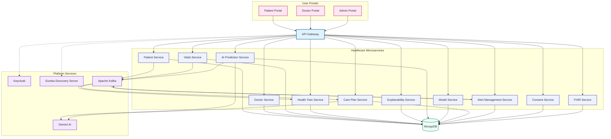


### Architecture Layers

| Layer | Components | Responsibility |
|---|---|---|
| Presentation | Patient Portal, Doctor Portal, Admin Portal | Role-specific healthcare interfaces |
| Gateway | API Gateway | Central API routing |
| Security | Keycloak | Authentication and authorization |
| Discovery | Eureka Discovery Server | Service registration and discovery |
| Business Services | Patient, Doctor, Vitals, Health Twin, AI, Care Plan, Alert, Consent, FHIR | Healthcare domain processing |
| Messaging | Apache Kafka | Asynchronous event communication |
| AI | AI Prediction, Explainability, Model Service, Gemini AI | Risk analysis and AI-assisted workflows |
| Data | MongoDB | Persistent healthcare data |
| Interoperability | FHIR Service | Standardized healthcare data exchange |

---


| Layer | Components | Responsibility |
|---|---|---|
| Presentation | React, Vite, Axios | User portals and UI |
| Gateway | API Gateway | Central routing and API entry |
| Security | Keycloak | Authentication and roles |
| Discovery | Eureka | Service registration/discovery |
| Business | Spring Boot microservices | Domain logic |
| Messaging | Kafka | Asynchronous events |
| AI | Gemini + prediction services | Risk analysis and AI assistance |
| Data | MongoDB | Persistent healthcare data |
| Interoperability | FHIR Service | Healthcare data exchange |

---

# 🧩 Microservices

| Service | Responsibility |
|---|---|
| **PatientService** | Patient records and doctor assignment |
| **DoctorService** | Doctor profiles and management |
| **VitalsService** | Vital measurements and history |
| **HealthTwinService** | Digital health representation |
| **AIPredictionService** | Risk/anomaly prediction |
| **ExplainabilityService** | Prediction explanation |
| **ModelService** | Model-related functionality |
| **CarePlanService** | AI care plans, review and approval |
| **ConsentService** | Consent management |
| **FHIRService** | Healthcare interoperability |
| **alert-management-service** | Alert processing |
| **ApiGateway** | Central API routing |
| **DiscoveryServer** | Eureka service discovery |

---

# 🧬 AI & Digital Health Twin

The Digital Health Twin combines patient information and monitoring data to provide a continuously updated health representation.

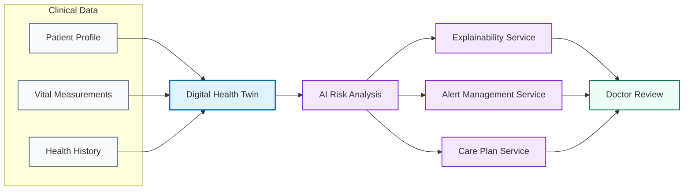

### AI Prediction Flow

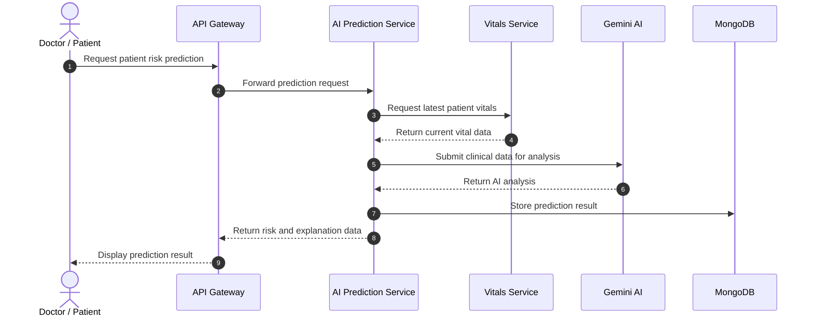

---

# 📋 Care Plan Architecture

Care plans are generated using patient/clinical information and reviewed before becoming available to the patient.

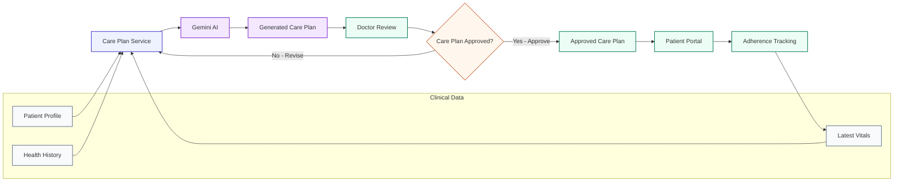

| Care Plan Area | Purpose |
|---|---|
| Diagnosis | Clinical context |
| Risk Level | Risk classification |
| Risk Percentage | Risk estimate |
| Health Score | Overall health indicator |
| Medications | Medication recommendations |
| Diet | Dietary recommendations |
| Exercise | Exercise recommendations |
| Lifestyle | Lifestyle recommendations |
| Water Target | Daily hydration target |
| Sleep | Sleep recommendation |
| Doctor Notes | Clinical review |
| Next Review | Follow-up planning |
| Status | Draft / approved workflow |

---

# 🚨 Clinical Alert Workflow

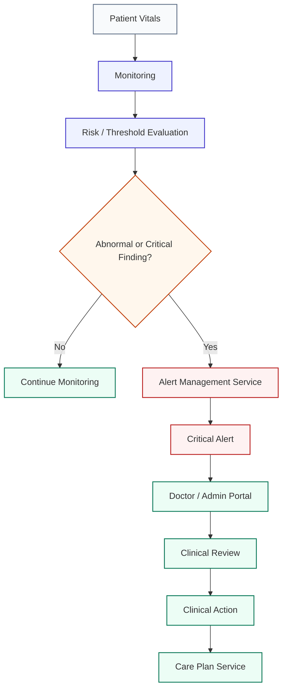

Alerts connect abnormal or high-risk findings with clinical attention.

---

# 🧭 Patient 360°

Patient 360° provides a consolidated view of important patient information.

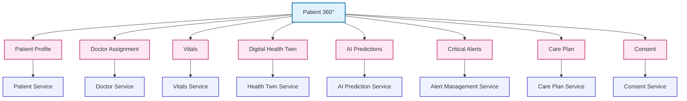

| User | Patient 360° Access |
|---|---|
| **Admin** | All patients |
| **Doctor** | Assigned patients |
| **Patient** | Own authorized information |

---

# 🔐 Security Architecture

```mermaid
flowchart LR
    U["User"] --> K["Keycloak Authentication"]
    K --> T["Access Token"]
    T --> G["API Gateway"]
    G --> R["Role-Based Authorization"]
    R --> S["Protected Microservices"]
    S --> DB[("MongoDB")]

    classDef user fill:#fce7f3,stroke:#be185d,stroke-width:1.5px;
    classDef security fill:#f3e8ff,stroke:#7e22ce,stroke-width:1.5px;
    classDef gateway fill:#e0f2fe,stroke:#0369a1,stroke-width:2px;
    classDef service fill:#eef2ff,stroke:#4338ca,stroke-width:1.5px;
    classDef data fill:#ecfdf5,stroke:#047857,stroke-width:1.5px;
    class U user;
    class K,T,R security;
    class G gateway;
    class S service;
    class DB data;
```

| Security Area | Implementation |
|---|---|
| Authentication | Keycloak |
| Authorization | Role-based access |
| API Entry | API Gateway |
| Service Access | Protected endpoints |
| Patient Mapping | Keycloak identity linked to patient record |
| Consent | Dedicated Consent Service |

---

# 📨 Event-Driven Architecture

Kafka supports asynchronous communication between services.

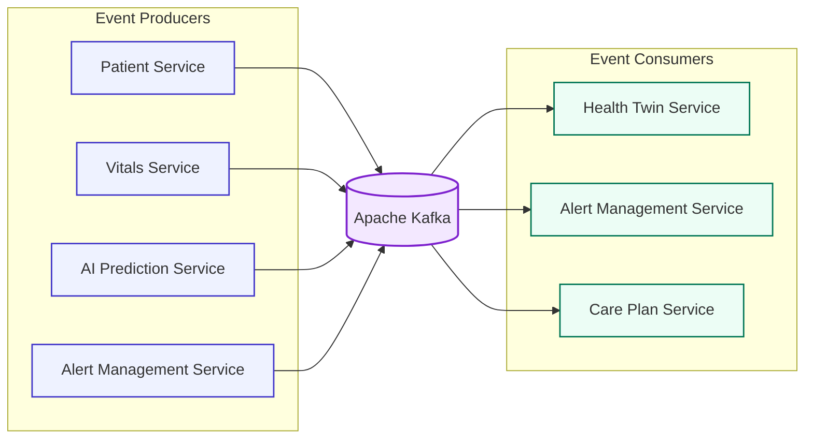

### Benefits

- Loose coupling
- Asynchronous processing
- Scalable event handling
- Real-time clinical workflows
- Easier integration between services

---

# 🔎 Service Discovery

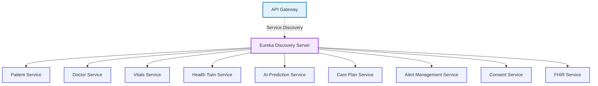

Eureka allows services to register and discover each other without relying only on fixed service locations.

---

# 🗄️ Data Architecture

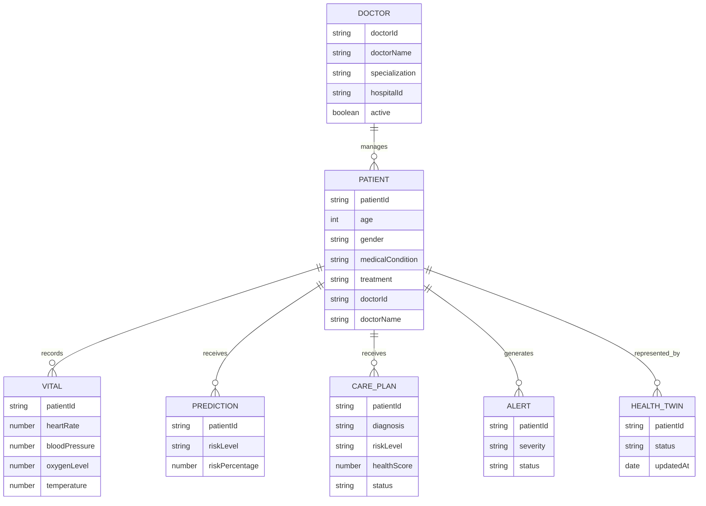

MongoDB provides persistent storage for the platform's service data.

---

# 📄 FHIR & Interoperability

The FHIR service provides a healthcare interoperability layer for exchanging standardized healthcare information.

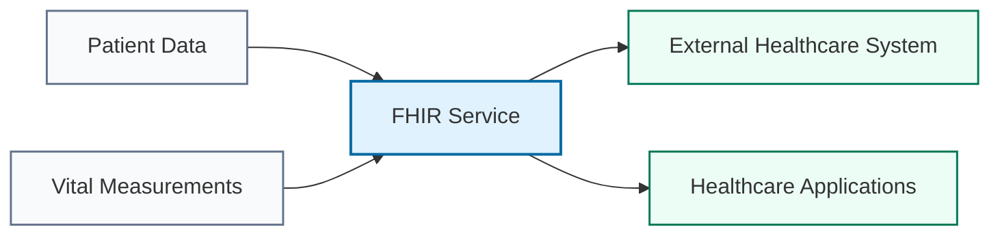

---

# 🌐 API Gateway

The API Gateway provides a single entry point for frontend requests.

```text
React Frontend
      │
      ▼
API Gateway
      │
 ┌────┼───────────────┐
 ▼    ▼       ▼       ▼
Patient Doctor Vitals AI
Service Service Service Service
```

| Gateway Responsibility | Description |
|---|---|
| Routing | Sends requests to the correct service |
| Central Entry | One frontend API entry point |
| Security Integration | Works with authentication |
| Service Discovery | Works with Eureka |
| Scalability | Simplifies service scaling |

---

# 🧰 Technology Stack

| Category | Technology |
|---|---|
| Frontend | React, Vite, Axios |
| Backend | Java, Spring Boot |
| Architecture | Microservices |
| Database | MongoDB |
| Security | Keycloak |
| Messaging | Apache Kafka |
| Discovery | Eureka |
| Gateway | Spring Cloud Gateway |
| AI | Gemini |
| Interoperability | FHIR |
| Build | Maven |
| Deployment | Docker |

---

# 🌐 Service & Port Configuration

| Service | Application Name | Port | Main Responsibility |
|---|---|---:|---|
| **Frontend – React/Vite** | — | `5173` | Patient, Doctor & Admin portals |
| **API Gateway** | `ApiGateway` | `8088` | Central API routing and load-balanced service access |
| **Discovery Server – Eureka** | `DiscoveryServer` | `8761` | Service registration and discovery |
| **Patient Service** | `PatientService` | `8090` | Patient records and doctor assignment |
| **Vitals Service** | `VITALSSERVICE` | `8082` | Patient vital measurements |
| **Health Twin Service** | `HealthTwinService` | `8083` | Digital Health Twin and vital-event processing |
| **Consent Service** | `ConsentService` | `8084` | Patient consent management |
| **AI Prediction Service** | `AIPredictionService` | `8085` | AI risk/anomaly prediction |
| **Care Plan Service** | `CarePlanService` | `8086` | AI care-plan generation, review and approval |
| **Explainability Service** | `ExplainabilityService` | `8087` | Prediction explanation |
| **Model Service** | `ModelService` | `8089` | Model-related functionality |
| **FHIR Service** | `FHIRSERVICE` | `8091` | Healthcare interoperability |
| **Alert Management Service** | `ALERT-MANAGEMENT-SERVICE` | `8092` | Clinical alert management |
| **MongoDB** | — | `27017` | Persistent healthcare data |
| **Apache Kafka** | — | `9092` | Event-driven communication |
| **Flask AI Model** | — | `5000` | Prediction model endpoint |

### Gateway Routes

| Route | Target Service | Gateway Path |
|---|---|---|
| Patient Service | `PATIENTSERVICE` | `/patients/**` |
| Vitals Service | `VITALSSERVICE` | `/vitals/**` |
| Health Twin Service | `HEALTHTWINSERVICE` | `/healthtwins/**` |
| Consent Service | `CONSENTSERVICE` | `/consents/**` |
| FHIR Service | `FHIRSERVICE` | `/fhir/**` |
| AI Prediction Service | `AIPREDICTIONSERVICE` | `/api/prediction/**` |
| Explainability Service | `EXPLAINABILITYSERVICE` | `/explanations/**` |
| Alert Management Service | `ALERT-MANAGEMENT-SERVICE` | `/api/alerts/**` |
| Care Plan Service | `CAREPLANSERVICE` | `/careplans/**` |
| Care Plan Adherence | `CAREPLANSERVICE` | `/adherence/**` |
| Model Service | `MODELSERVICE` | `/models/**` |
| Doctor Route | `PATIENTSERVICE` | `/doctors/**` |

> **Note:** The configuration provided shows the Doctor route being handled by `PATIENTSERVICE`. No separate Doctor Service application/port configuration was provided.

---

# 🔌 API Overview

| Service | Main Endpoints |
|---|---|
| Patient | `/patients`, `/patients/{id}`, `/patients/doctor/{doctorId}` |
| Doctor | `/doctors`, `/doctors/{id}`, `/doctors/active/{active}` |
| Vitals | `/vitals`, `/vitals/patient/{patientId}`, `/vitals/patient/{patientId}/latest` |
| Health Twin | `/healthtwins`, `/healthtwins/{id}` |
| AI Prediction | `/api/prediction/vitals/{patientId}`, `/api/prediction/history/{patientId}` |
| Care Plan | `/careplans/patient/{patientId}/latest`, `/careplans/generate/{patientId}` |
| Consent | Consent management endpoints |
| FHIR | FHIR resource endpoints |
| Alerts | Alert management endpoints |

---

# 📁 Project Structure

```text
Healthcare-Management-Platform/
│
├── frontend/
│   ├── src/
│   ├── components/
│   ├── pages/
│   └── services/
│
├── PatientService/
├── DoctorService/
├── VitalsService/
├── HealthTwinService/
├── AIPredictionService/
├── ExplainabilityService/
├── ModelService/
├── CarePlanService/
├── ConsentService/
├── FHIRService/
├── alert-management-service/
├── ApiGateway/
├── DiscoveryServer/
│
├── MediSphere-AI/
├── DataSets/
├── docker/
└── README.md
```

---

# 🚀 Local Development

## Prerequisites

- Java / JDK
- Maven
- Node.js and npm
- MongoDB
- Kafka
- Keycloak
- Docker
- Git

## Start Infrastructure

```text
MongoDB  → 27017
Kafka    → 9092
Eureka   → 8761
Frontend → 5173
```

Start the required Spring Boot services, then API Gateway and frontend.

### Frontend

```bash
npm install
npm run dev
```

Typical frontend URL:

```text
http://localhost:5173
```

---

# 🧪 Testing

Important workflows to test:

| Workflow | Expected Result |
|---|---|
| Login | User authenticates through Keycloak |
| Patient Management | Patient records load and update |
| Doctor Assignment | Admin can assign/revoke doctors |
| Patient 360° | Correct role-based patient data appears |
| Vitals | Latest patient vitals are available |
| Health Twin | Patient health representation is displayed |
| AI Prediction | Prediction and explanation are returned |
| Alerts | Critical findings create alert workflow |
| Care Plan | AI plan can be reviewed and approved |
| Patient Care | Patient sees approved plan and adherence |
| Security | Users cannot access unauthorized patient data |

---

## 📊 Project Status

| Area | Status |
|---|---|
| Patient Portal | ✅ Completed |
| Doctor Portal | ✅ Completed |
| Admin Portal | ✅ Completed |
| Patient Management | ✅ Completed |
| Doctor Management | ✅ Completed |
| Patient Assignment | ✅ Completed |
| Patient 360° | ✅ Completed |
| Vitals | ✅ Completed |
| Digital Health Twin | ✅ Completed |
| AI Prediction | ✅ Completed |
| Explainability | ✅ Completed |
| Alerts | ✅ Completed |
| AI Care Plans | ✅ Completed |
| Consent | ✅ Completed |
| FHIR | ✅ Completed |
| Keycloak Security | ✅ Completed |
| Kafka Events | ✅ Completed |
| Eureka Discovery | ✅ Completed |
| API Gateway | ✅ Completed |

**Overall Status: ✅ Completed**

---

# 📈 Scalability

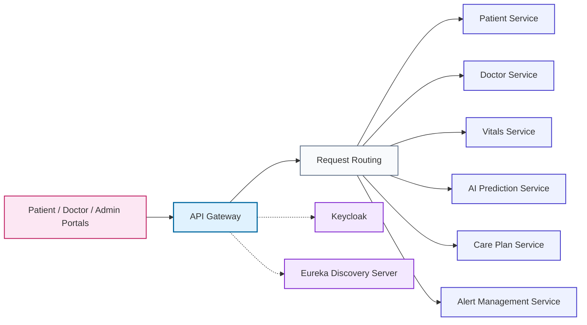

The microservice design supports independent scaling of high-load services such as vitals, AI prediction and alerts.

---

# 💡 Design Principles

| Principle | Implementation |
|---|---|
| Domain Separation | Separate services for healthcare domains |
| API-First | REST APIs between frontend and backend |
| Secure Identity | Keycloak authentication and roles |
| Event-Driven | Kafka-based asynchronous communication |
| AI as Decision Support | AI assists clinical workflows |
| Interoperability | FHIR-based healthcare exchange |
| Patient-Centric | Patient 360° connects clinical information |

---

# 🎬 Recommended Demo Flow

```text
1. Login
   ↓
2. Open Admin Portal
   ↓
3. Select Patient
   ↓
4. Assign Doctor
   ↓
5. Login as Doctor
   ↓
6. Open Assigned Patient
   ↓
7. View Patient 360°
   ↓
8. Check Vitals / Health Twin
   ↓
9. Run AI Risk Prediction
   ↓
10. Review Alert
   ↓
11. Generate Care Plan
   ↓
12. Doctor Approves
   ↓
13. Patient Views Approved Plan
   ↓
14. Patient Tracks Adherence
```

---

# 🏆 Project Value

The platform demonstrates how modern healthcare applications can combine:

- Microservices
- Real-time monitoring
- Digital Health Twin
- AI-assisted risk prediction
- Explainable results
- Clinical alerts
- Personalized care plans
- Secure role-based access
- Event-driven architecture
- Healthcare interoperability

### In one sentence

> **A connected healthcare platform that transforms patient data into actionable clinical workflows through monitoring, AI-assisted insights, alerts and personalized care planning.**
